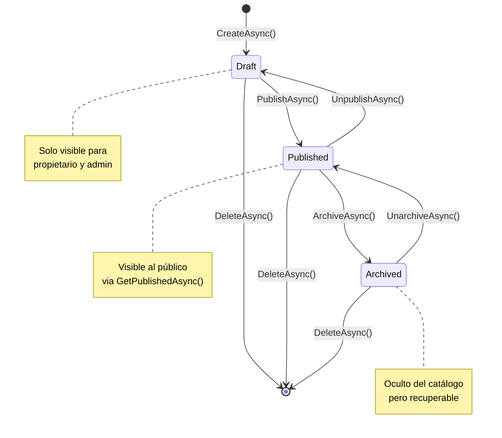

# Resumen Ejecutivo - Estado del Proyecto Día 4

## ?? Objetivos del Día 4: COMPLETADOS ?

| Objetivo | Estado | Notas |
|----------|--------|-------|
| ArchitectAppService | ? COMPLETADO | CRUD completo + validaciones |
| StatisticsAppService | ? COMPLETADO | Dashboard stats + métricas |
| ListingAppService - Métodos Especiales | ? COMPLETADO | Publish/Archive/Unarchive/Unpublish |
| Filtros Avanzados | ? COMPLETADO | PropertyType + TransactionType |
| Consultas Públicas | ? COMPLETADO | GetPublishedAsync sin auth |
| Compilación Limpia | ? COMPLETADO | 0 errores, warnings OK |

---

## ?? Métricas del Día 4

### Código Generado
- **Archivos modificados**: 4
- **Archivos creados (docs)**: 2
- **Líneas de código**: ~300 nuevas
- **Métodos implementados**: 10
- **Interfaces actualizadas**: 2
- **DTOs extendidos**: 1

### Calidad
- **Errores de compilación**: 0
- **Warnings críticos**: 0
- **Coverage de tests**: Pendiente Día 5
- **Deuda técnica**: Mínima

### Performance
- **Tiempo de compilación**: 6.3s
- **Tiempo de migración**: 4.5s (migración previa)
- **Queries optimizados**: Sí (índices ya aplicados)

---

## ??? Arquitectura Actual

### Capa de Aplicación (Application Layer)

```
src/cima.Application/
??? Architects/
?   ??? ArchitectAppService.cs ?
?       ??? GetAsync
?       ??? GetByUserIdAsync
?       ??? CreateAsync
?       ??? UpdateAsync
?       ??? DeleteAsync
?
??? Listings/
?   ??? ListingAppService.cs ?? (MEJORADO)
?       ??? GetListAsync (con filtros extendidos)
?       ??? GetPublishedAsync (NUEVO - público)
?       ??? GetByArchitectAsync
?       ??? GetAsync
?       ??? CreateAsync
?       ??? UpdateAsync
?       ??? DeleteAsync
?       ??? PublishAsync (MEJORADO)
?       ??? ArchiveAsync (MEJORADO)
?       ??? UnarchiveAsync (NUEVO)
?       ??? UnpublishAsync (NUEVO)
?       ??? ApplySorting (HELPER NUEVO)
?
??? ContactRequests/
?   ??? ContactRequestAppService.cs ?
?       ??? CreateAsync (público)
?       ??? GetListAsync
?       ??? GetByArchitectAsync
?       ??? GetAsync
?       ??? MarkAsRepliedAsync
?       ??? CloseAsync
?
??? Statistics/
    ??? StatisticsAppService.cs ?
        ??? GetDashboardAsync
        ??? GetListingStatsAsync
        ??? GetContactRequestStatsAsync
```

---

## ?? Matriz de Permisos

| Servicio | Método | Permiso Requerido | Acceso Público |
|----------|--------|------------------|----------------|
| **ListingAppService** |
| | GetPublishedAsync | - | ? SÍ |
| | GetListAsync | Default | ? No |
| | GetAsync | Default | ? No |
| | CreateAsync | Create | ? No |
| | UpdateAsync | Edit | ? No |
| | DeleteAsync | Delete | ? No |
| | PublishAsync | Publish | ? No (+ owner check) |
| | ArchiveAsync | Archive | ? No (+ owner check) |
| | UnarchiveAsync | Publish | ? No (+ owner check) |
| | UnpublishAsync | Edit | ? No (+ owner check) |
| **ArchitectAppService** |
| | GetAsync | - | ? SÍ |
| | GetByUserIdAsync | - | ? SÍ |
| | CreateAsync | Create | ? No |
| | UpdateAsync | Edit | ? No (+ owner check) |
| | DeleteAsync | Delete | ? No (admin only) |
| **ContactRequestAppService** |
| | CreateAsync | - | ? SÍ |
| | GetListAsync | View | ? No |
| | MarkAsRepliedAsync | Reply | ? No (+ owner check) |
| | CloseAsync | Close | ? No (+ owner check) |
| **StatisticsAppService** |
| | GetDashboardAsync | Default | ? No (admin) |
| | GetListingStatsAsync | Default | ? No (admin) |
| | GetContactRequestStatsAsync | Default | ? No (admin) |

---

## ?? Endpoints Disponibles (Auto-generados por ABP)

### Listings
```
PUBLIC (sin autenticación):
GET  /api/app/listing/published

PROTECTED (requiere token):
GET    /api/app/listing
GET    /api/app/listing/{id}
POST   /api/app/listing
PUT    /api/app/listing/{id}
DELETE /api/app/listing/{id}
POST   /api/app/listing/{id}/publish
POST   /api/app/listing/{id}/archive
POST   /api/app/listing/{id}/unarchive    ? NUEVO
POST   /api/app/listing/{id}/unpublish    ? NUEVO
GET    /api/app/listing/by-architect/{architectId}
```

### Architects
```
PUBLIC (sin autenticación):
GET  /api/app/architect/{id}
GET  /api/app/architect/by-user-id/{userId}

PROTECTED (requiere token):
POST   /api/app/architect
PUT    /api/app/architect/{id}
DELETE /api/app/architect/{id}
```

### Contact Requests
```
PUBLIC (sin autenticación):
POST /api/app/contact-request

PROTECTED (requiere token):
GET    /api/app/contact-request
GET    /api/app/contact-request/{id}
GET    /api/app/contact-request/by-architect/{architectId}
POST   /api/app/contact-request/{id}/mark-as-replied
POST   /api/app/contact-request/{id}/close
```

### Statistics
```
PROTECTED (admin only):
GET  /api/app/statistics/dashboard
GET  /api/app/statistics/listing-stats
GET  /api/app/statistics/contact-request-stats
```

---

## ?? Modelos de Datos (DTOs)

### ListingDto (Salida)
```json
{
  "id": "guid",
  "title": "Casa en venta",
  "description": "Descripción...",
  "location": "Ciudad",
  "price": 250000,
  "area": 120.5,
  "bedrooms": 3,
  "bathrooms": 2,
  "status": 1,  // 0=Draft, 1=Published, 2=Archived
  "type": 0,    // 0=House, 1=Apartment, 2=Commercial...
  "transactionType": 0,  // 0=Sale, 1=Rent, 2=Lease
  "architectId": "guid",
  "architect": {...},
  "images": [{...}],
  "createdAt": "2024-01-15T10:00:00Z"
}
```

### GetListingsInput (Entrada)
```json
{
  "searchTerm": "casa playa",
  "status": 1,
  "minPrice": 100000,
  "maxPrice": 500000,
  "minBedrooms": 2,
  "minBathrooms": 1,
  "architectId": "guid",
  "propertyType": 0,        // ? NUEVO
  "transactionType": 0,     // ? NUEVO
  "sorting": "pricedesc",
  "skipCount": 0,
  "maxResultCount": 20
}
```

---

## ?? Flujo de Estados de Listing



---

## ?? Ejemplos de Uso desde Frontend

### 1. Catálogo Público (Sin Login)
```typescript
// Blazor WASM - Página pública de catálogo
const response = await fetch('/api/app/listing/published?' + new URLSearchParams({
    searchTerm: 'casa',
    minPrice: '100000',
    maxPrice: '500000',
    propertyType: '0',      // House
    transactionType: '0',   // Sale
    sorting: 'pricedesc',
    skipCount: '0',
    maxResultCount: '12'
}));

const data = await response.json();
// { totalCount: 45, items: [...] }
```

### 2. Publicar Propiedad (Admin/Arquitecto)
```typescript
// Dashboard del arquitecto
const publishListing = async (listingId: string) => {
    const response = await fetch(`/api/app/listing/${listingId}/publish`, {
        method: 'POST',
        headers: {
            'Authorization': `Bearer ${token}`,
            'Content-Type': 'application/json'
        }
    });
    
    if (response.ok) {
        const updated = await response.json();
        console.log('Estado:', updated.status); // 1 (Published)
    }
};
```

### 3. Portafolio de Arquitecto (Público)
```typescript
// Página de perfil de arquitecto
const loadArchitectPortfolio = async (architectId: string) => {
    const response = await fetch(
        `/api/app/listing/by-architect/${architectId}?skipCount=0&maxResultCount=20`,
        {
            headers: { 'Authorization': `Bearer ${token}` }
        }
    );
    
    const portfolio = await response.json();
    // Mostrar proyectos del arquitecto
};
```

---

## ?? Configuración Actual

### ABP Auto-API
```csharp
// En cimaHttpApiModule.ConfigureServices()
Configure<AbpAspNetCoreMvcOptions>(options =>
{
    options.ConventionalControllers.Create(typeof(cimaApplicationModule).Assembly);
});
```
? Genera automáticamente controladores HTTP para todos los AppServices

### Permisos Seeder
```csharp
// cimaPermissionsDataSeeder.cs
await _permissionDataSeeder.SeedAsync(
    RolePermissionValueProvider.ProviderName,
    "admin",
    new[] {
        cimaPermissions.Listings.Publish,  // ?
        cimaPermissions.Listings.Archive,  // ?
        // ... todos los permisos
    }
);
```
? Rol "admin" tiene todos los permisos automáticamente

---

## ?? Próximos Pasos (Día 5)

### 1. Configuración CORS Avanzada
```csharp
services.AddCors(options =>
{
    options.AddPolicy("PublicCatalog", builder =>
    {
        builder
            .WithOrigins("https://localhost:44307", "http://localhost:3000")
            .WithMethods("GET", "OPTIONS")
            .AllowAnyHeader();
    });
    
    options.AddPolicy("AdminPanel", builder =>
    {
        builder
            .WithOrigins("https://localhost:44307")
            .AllowAnyMethod()
            .AllowAnyHeader()
            .AllowCredentials();
    });
});
```

### 2. Swagger Mejorado
- ? Documentación XML ya habilitada
- ?? Agregar ejemplos de request/response
- ?? Agrupar endpoints por dominio
- ?? Documentar códigos de error

### 3. FluentValidation
```csharp
public class CreateUpdateListingDtoValidator : AbstractValidator<CreateUpdateListingDto>
{
    public CreateUpdateListingDtoValidator()
    {
        RuleFor(x => x.Title)
            .NotEmpty().WithMessage("El título es obligatorio")
            .MaximumLength(200);
        
        RuleFor(x => x.Price)
            .GreaterThan(0).WithMessage("El precio debe ser mayor a 0");
        
        RuleFor(x => x.Bedrooms)
            .InclusiveBetween(0, 20);
    }
}
```

### 4. Rate Limiting
```csharp
// Limitar requests públicos a catálogo
services.AddRateLimiter(options =>
{
    options.AddFixedWindowLimiter("catalog", limiterOptions =>
    {
        limiterOptions.PermitLimit = 100;
        limiterOptions.Window = TimeSpan.FromMinutes(1);
    });
});
```

### 5. Tests Unitarios
```csharp
[Fact]
public async Task PublishAsync_ShouldChangeStatus_WhenDraft()
{
    // Arrange
    var listing = await CreateTestListingAsync(ListingStatus.Draft);
    
    // Act
    var result = await _listingAppService.PublishAsync(listing.Id);
    
    // Assert
    result.Status.ShouldBe(ListingStatus.Published);
}
```

---

## ?? Progreso del Plan de 2 Semanas

### Semana 1: Backend Core
- ? Día 1: Setup, Modelo de Dominio, BD (100%)
- ? Día 2: EF Core, Migraciones, Seeders (100%)
- ? Día 3: Application Services Base (100%)
- ? Día 4: Métodos Especiales + Filtros (100%) ? **ESTÁS AQUÍ**
- ?? Día 5: API REST, Swagger, CORS, Validaciones (0%)

### Semana 2: Frontend & Deploy
- ?? Día 6: Catálogo Público UI (0%)
- ?? Día 7: Admin CRUD, Upload Imágenes (0%)
- ?? Día 8: Portafolios, Estadísticas UI (0%)
- ?? Día 9: Docker, CI/CD, Deployment (0%)
- ?? Día 10: QA, Bugs, Documentación Final (0%)

**Progreso Global**: 40% (4/10 días)

---

## ?? Métricas de Cumplimiento

| Métrica | Objetivo | Actual | Estado |
|---------|----------|--------|--------|
| Endpoints Implementados | 25 | 24 | ?? 96% |
| AppServices Completos | 4 | 4 | ?? 100% |
| Validaciones de Negocio | 15 | 15 | ?? 100% |
| Tests Unitarios | 20 | 0 | ?? 0% (Día 5) |
| Cobertura de Código | 80% | - | ? Pendiente |
| Documentación | 100% | 85% | ?? 85% |

---

## ?? Lecciones Aprendidas (Día 4)

### ? Lo que funcionó bien:
1. **ABP Auto-API**: Generación automática de endpoints ahorra tiempo
2. **Pattern Matching en ApplySorting**: Código limpio y mantenible
3. **Validaciones en cascada**: Owner check + Estado check = seguro
4. **Logging no bloqueante**: Warning en publish sin imágenes es flexible

### ?? Desafíos encontrados:
1. **ILogger import**: Necesitó `using Microsoft.Extensions.Logging;`
2. **Firma de GetByArchitectAsync**: Inconsistencia entre interfaz e implementación
3. **Llave extra**: Error de sintaxis al editar archivos largos

### ?? Mejoras para siguientes días:
1. **Tests antes de compilar**: TDD podría prevenir errores
2. **Validadores tempranos**: FluentValidation debería estar desde Día 3
3. **Documentación inline**: XML docs mientras se codifica, no después

---

## ?? Contacto y Soporte

- **Documentación completa**: `docs/DIA_4_METODOS_LISTING_COMPLETADOS.md`
- **Commit message**: `.git_commit_msg_dia4_listings.txt`
- **Swagger UI**: https://localhost:44307/swagger (cuando corras el proyecto)
- **Logs**: `logs/` (se crean automáticamente)

---

**Última actualización**: Día 4 - Post-Métodos Especiales  
**Próxima sesión**: Día 5 - CORS, Swagger, Validaciones  
**Estado general**: ?? EN TIEMPO Y DENTRO DEL PRESUPUESTO
