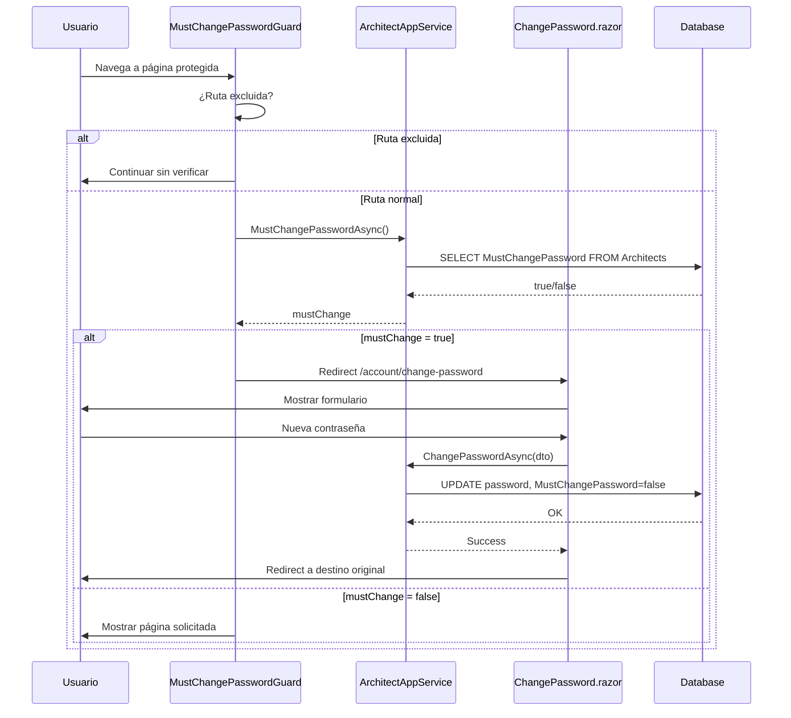

# Flujo de Autenticación - 4cima

Este documento describe el flujo completo de autenticación en la aplicación 4cima, incluyendo login, redirección por rol, cambio de contraseña obligatorio y recuperación de contraseña.

## Diagrama General del Flujo

```mermaid
flowchart TD
    subgraph "Acceso Inicial"
        A[Usuario accede a ruta] --> B{¿Ruta protegida?}
        B -->|No| C[Mostrar página pública]
        B -->|Sí| D{¿Autenticado?}
    end

    subgraph "Verificación de Autenticación"
        D -->|No| E[RedirectToLogin.razor]
        E --> F[ABP Account/Login<br/>con returnUrl]
        D -->|Sí| G{¿Tiene permisos?}
        G -->|No| H[AccessDenied.razor]
        G -->|Sí| I[MustChangePasswordGuard]
    end

    subgraph "Flujo de Login ABP"
        F --> J[Página de Login]
        J --> K{Credenciales válidas?}
        K -->|No| L[Mostrar error]
        L --> J
        K -->|Sí| M[Crear sesión]
        M --> N{Remember Me?}
        N -->|Sí| O[Cookie persistente<br/>14 días]
        N -->|No| P[Cookie de sesión]
        O --> Q[Redirect post-login]
        P --> Q
    end

    subgraph "Verificación MustChangePassword"
        I --> R{¿MustChangePassword?}
        R -->|Sí| S[Redirect a<br/>/account/change-password]
        S --> T[ChangePassword.razor]
        T --> U{Contraseña cambiada?}
        U -->|No| T
        U -->|Sí| V[Actualizar flag]
        V --> W[Redirect a destino original]
        R -->|No| X[Continuar al destino]
    end

    subgraph "Redirección por Rol"
        Q --> Y[PostLogin.razor]
        Y --> Z{Verificar rol}
        Z -->|Admin| AA[/admin/dashboard]
        Z -->|Architect| AB[/architect/dashboard]
        Z -->|returnUrl válido| AC[returnUrl]
        Z -->|Otro| AD[/]
    end

    X --> AE[Mostrar página solicitada]

    style A fill:#e1f5fe
    style J fill:#fff3e0
    style T fill:#fce4ec
    style Y fill:#e8f5e9
    style H fill:#ffebee
```

## Flujo de Recuperación de Contraseña


## Componentes Involucrados

### Cliente (Blazor WebAssembly)

| Componente | Ruta | Descripción |
|------------|------|-------------|
| `RedirectToLogin.razor` | - | Redirige a ABP Login preservando returnUrl |
| `PostLogin.razor` | `/account/post-login` | Maneja redirección post-login por rol |
| `AccessDenied.razor` | `/account/access-denied` | Página de acceso denegado |
| `ChangePassword.razor` | `/account/change-password` | Cambio de contraseña (obligatorio o voluntario) |
| `MustChangePasswordGuard.razor` | - | Guarda que verifica si debe cambiar contraseña |
| `LoginRedirectService.cs` | - | Servicio de lógica de redirección |

### Servidor (ABP Account Module)

| Página | Ruta | Descripción |
|--------|------|-------------|
| Login.cshtml | `/Account/Login` | Página de login |
| ForgotPassword.cshtml | `/Account/ForgotPassword` | Solicitar reset |
| ResetPassword.cshtml | `/Account/ResetPassword` | Cambiar contraseña con token |
| Logout | `/Account/Logout` | Cerrar sesión |

## Configuración de Remember Me

ABP Identity configura automáticamente la cookie de autenticación. La opción "Remember Me" en el login:

- **Activada**: Cookie persiste 14 días (configurable)
- **Desactivada**: Cookie expira al cerrar el navegador

### Configurar duración de Remember Me

```csharp
// En cimaBlazorModule.cs o IdentityModule
Configure<SecurityStampValidatorOptions>(options =>
{
    options.ValidationInterval = TimeSpan.FromMinutes(30);
});

Configure<IdentityOptions>(options =>
{
    // Duración del refresh token
    options.Lockout.DefaultLockoutTimeSpan = TimeSpan.FromMinutes(5);
});
```

## Configuración de Recuperación de Contraseña

### 1. Configurar servicio de email

En `appsettings.json`:

```json
{
  "Smtp": {
    "Host": "smtp.example.com",
    "Port": 587,
    "UserName": "noreply@4cima.com",
    "Password": "secret",
    "EnableSsl": true,
    "From": "noreply@4cima.com",
    "FromDisplayName": "4cima - No Reply"
  }
}
```

O para Azure Communication Services:

```json
{
  "Azure": {
    "Communication": {
      "ConnectionString": "endpoint=https://xxx.communication.azure.com/;accesskey=xxx",
      "SenderEmail": "noreply@4cima.com"
    }
  }
}
```

### 2. Servicios de Email Disponibles

```
src/cima.Application/Notifications/
??? SmtpEmailNotificationService.cs      # SMTP tradicional
??? AzureEmailNotificationService.cs     # Azure Communication
??? EmailNotificationServiceExtensions.cs # Registro de servicios
```

### 3. Plantillas de Email

ABP usa el sistema de Virtual File System para plantillas. Las plantillas predeterminadas están en:

```
Volo.Abp.Account.Web/Pages/Account/
??? ForgotPassword.cshtml
??? ResetPassword.cshtml
??? EmailTemplates/
    ??? PasswordResetLink.tpl
```

Para personalizar, crear en el proyecto Blazor:

```
src/cima.Blazor/Pages/Account/
??? ForgotPassword.cshtml (override)
??? ResetPassword.cshtml (override)
??? EmailTemplates/
    ??? PasswordResetLink.tpl (override)
```

## Flujo de MustChangePassword



## Rutas Excluidas del Guard

El `MustChangePasswordGuard` no verifica estas rutas para evitar loops:

```csharp
private static readonly string[] ExcludedPaths = 
{
    "/account/change-password",
    "/account/login",
    "/account/logout",
    "/account/register",
    "/authentication",
    "/signin-oidc",
    "/signout-callback-oidc"
};
```

## Seguridad

### Validación de ReturnUrl

El `LoginRedirectService` valida returnUrl para prevenir open redirect:

```csharp
private bool IsValidReturnUrl(string returnUrl)
{
    // Solo URLs relativas
    if (returnUrl.StartsWith("/") && !returnUrl.StartsWith("//"))
        return true;

    // URLs del mismo origen
    var baseUri = new Uri(_navigation.BaseUri);
    var returnUri = new Uri(returnUrl, UriKind.RelativeOrAbsolute);
    return returnUri.Host == baseUri.Host;
}
```

### Tokens de Reset

- Tokens de reset tienen expiración configurable (default: 24h)
- Son de un solo uso
- Se invalidan al cambiar la contraseña

## Logs y Diagnóstico

El sistema genera logs para diagnóstico:

```
[INF] Usuario debe cambiar contraseña, redirigiendo...
[DBG] Token no autorizado durante verificación de cambio de contraseña
[DBG] Sin permisos para verificar cambio de contraseña
[WRN] Error durante verificación de cambio de contraseña obligatorio
```

## Próximos Pasos

1. [ ] Personalizar UI de Login con branding CIMA
2. [ ] Configurar plantillas de email personalizadas
3. [ ] Implementar 2FA (opcional)
4. [ ] Configurar política de contraseñas
5. [ ] Implementar bloqueo por intentos fallidos
